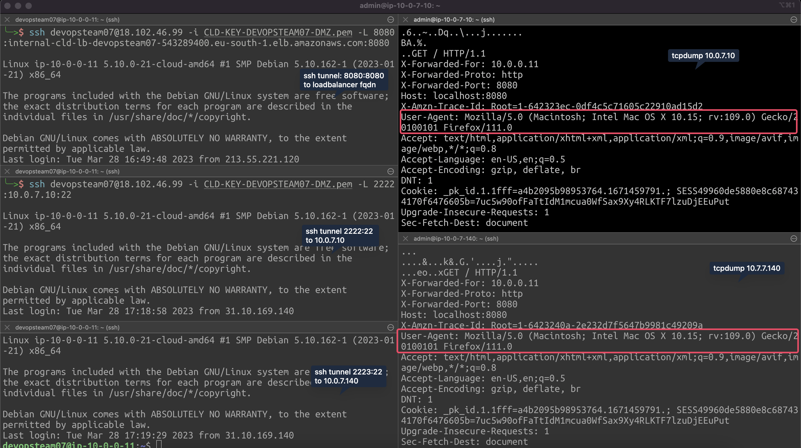

# C2 - Load Balancer

## Create and deploy a Web Load Balancer

****[**AWS Official doc**](https://aws.amazon.com/elasticloadbalancing/)****

### **Step 1: Create a Target Group**

| Setting          | Value                                                                                                                                                                                           |
| ---------------- | ----------------------------------------------------------------------------------------------------------------------------------------------------------------------------------------------- |
| Basic config     | <ul><li>Target type: instances</li><li>Target group name: CLD-LB-TG-DEVOPSTEAM[XX]</li><li>Protocol : HTTP</li><li>Port : 8080</li><li>VPC : VPC-CLD</li><li>Protocol version : HTTP1</li></ul> |
| Health checks    | <ul><li>HTTP</li><li>Health check path: "/drupal" or "/" (depending on your config)</li><li>Advanced health check settings: no change required</li></ul>                                        |
| Attributes       | none                                                                                                                                                                                            |
| Tags - optional  | <ul><li>Key : Name</li><li>Value :  CLD-LB-TG-DEVOPSTEAM[XX]</li></ul>                                                                                                                          |
| \*\*\*\*         | \*\*\*                                                                                                                                                                                          |
| Register targets | <ul><li>Choose your instance</li><li>Ports : 8080</li><li>Include it as pending </li></ul>                                                                                                      |

```
[INPUT]
aws elbv2 create-target-group \
  --name CLD-LB-TG-DEVOPSTEAM07 \
  --protocol HTTP \
  --target-type instance \
  --health-check-protocol HTTP \
  --health-check-path / \
  --port 8080 \
  --vpc-id vpc-0ae930118f4e3cf79 \
  --tags Key=Name,Value=CLD-LB-TG-DEVOPSTEAM07

aws elbv2 register-targets \
         --target-group-arn arn:aws:elasticloadbalancing:eu-south-1:709024702237:targetgroup/CLD-LB-TG-DEVOPSTEAM07/4426121d4b4513ba \
         --targets Id="i-08a161e13dd2797be",Port=8080
[OUTPUT]
  HealthCheckPath: /
  HealthCheckPort: traffic-port
  HealthCheckProtocol: HTTP
  HealthCheckTimeoutSeconds: 5
  HealthyThresholdCount: 5
  IpAddressType: ipv4
  Matcher:
    HttpCode: '200'
  Port: 8080
  Protocol: HTTP
  ProtocolVersion: HTTP1
  TargetGroupArn: arn:aws:elasticloadbalancing:eu-south-1:709024702237:targetgroup/CLD-LB-TG-DEVOPSTEAM07/4426121d4b4513ba
  TargetGroupName: CLD-LB-TG-DEVOPSTEAM07
  TargetType: instance
  UnhealthyThresholdCount: 2
  VpcId: vpc-0ae930118f4e3cf79
```

### **Step 2: Create a Load balancer**

| Setting                         | Value                                                                                                                                                                                                                                            |
| ------------------------------- | ------------------------------------------------------------------------------------------------------------------------------------------------------------------------------------------------------------------------------------------------ |
| Type of Loadbalancer            | Application Load Balancer                                                                                                                                                                                                                        |
| Configure Load Balancer         | <ul><li>Name: CLD-LB-DEVOPSTEAM[XX]</li><li>Scheme: Internal</li><li>IP address type: ipv4</li></ul>                                                                                                                                             |
| Network mapping                 | <ul><li>VPC: VPC-CLD</li><li><p>SUBNETS:</p><ul><li>10.0.[XX].0/28 -> eu-south-1a</li><li>10.0.[XX[.128/28 -> eu-south-1b</li></ul></li></ul>                                                                                                    |
| Configure Security Groups       | <ul><li>Name : CLD-SG-LB-DEVOPSTEAM[XX]</li><li><p>Inbound rules:</p><ul><li>Type: Custom TCP</li><li>Port range: 8080</li><li>Source : DMZ</li></ul></li></ul>                                                                                  |
| Configure Listeners and routing | <ul><li>Protocol: HTTP</li><li>Port: 8080</li><li><p>Default action (forward to):</p><ul><li>CLD-LB-TG-DEVOPSTEAM[XX]</li></ul></li><li><p>Listener tags - optional:</p><ul><li>Key: Name</li><li>Value: CLD-LT-DEVOSPTEAM99</li></ul></li></ul> |
| Tags - optional                 | <ul><li>Key: Name</li><li>Value: CLD-LB-DEVOPSTEAM[99]</li></ul>                                                                                                                                                                                 |

```
[INPUT]
aws ec2 create-security-group \
    --group-name "CLD-SG-LB-DEVOPSTEAM07" \
    --description "CLD-SG-LB-DEVOPSTEAM07" \
    --vpc-id vpc-0ae930118f4e3cf79 \
    --tag-specifications 'ResourceType=security-group,Tags=[{Key=Name,Value=CLD-SG-LB-DEVOPSTEAM07}]'
aws ec2 authorize-security-group-ingress \
    --group-id sg-0d9d21e5e1dbfb0c8 \
    --protocol tcp \
    --port 8080 \
    --cidr 10.0.0.0/28

aws elbv2 create-load-balancer \
  --name CLD-LB-DEVOPSTEAM07 \
  --scheme internal \
  --type application \
  --subnets subnet-0e80be6dcbf923a59 subnet-0e8ffe3df60187d0b \
  --security-groups sg-0d9d21e5e1dbfb0c8 \
  --tags Key=Name,Value=CLD-LB-DEVOPSTEAM07
  
  aws elbv2 create-listener \
    --load-balancer-arn arn:aws:elasticloadbalancing:eu-south-1:709024702237:loadbalancer/app/CLD-LB-DEVOPSTEAM07/4ab48b74b34a8441 \
    --protocol HTTP \
    --port 8080 \
    --default-actions Type=forward,TargetGroupArn=arn:aws:elasticloadbalancing:eu-south-1:709024702237:targetgroup/CLD-LB-TG-DEVOPSTEAM07/4426121d4b4513ba

[OUTPUT]
GroupId: sg-0d9d21e5e1dbfb0c8
Tags:
- Key: Name
  Value: CLD-SG-LB-DEVOPSTEAM07

Return: true
SecurityGroupRules:
- CidrIpv4: 10.0.0.0/28
  FromPort: 8080
  GroupId: sg-0d9d21e5e1dbfb0c8
  GroupOwnerId: '709024702237'
  IpProtocol: tcp
  IsEgress: false
  SecurityGroupRuleId: sgr-0089ae642074ef4b4
  ToPort: 8080

LoadBalancers:
- AvailabilityZones:
  - LoadBalancerAddresses: []
    SubnetId: subnet-0e80be6dcbf923a59
    ZoneName: eu-south-1a
  - LoadBalancerAddresses: []
    SubnetId: subnet-0e8ffe3df60187d0b
    ZoneName: eu-south-1b
  CanonicalHostedZoneId: Z3ULH7SSC9OV64
  CreatedTime: '2023-03-28T15:35:49+00:00'
  DNSName: internal-CLD-LB-DEVOPSTEAM07-543289400.eu-south-1.elb.amazonaws.com
  IpAddressType: ipv4
  LoadBalancerArn: arn:aws:elasticloadbalancing:eu-south-1:709024702237:loadbalancer/app/CLD-LB-DEVOPSTEAM07/4ab48b74b34a8441
  LoadBalancerName: CLD-LB-DEVOPSTEAM07
  Scheme: internal
  SecurityGroups:
  - sg-0d9d21e5e1dbfb0c8
  State:
    Code: provisioning
  Type: application
  VpcId: vpc-0ae930118f4e3cf79

Listeners:
- DefaultActions:
  - ForwardConfig:
      TargetGroupStickinessConfig:
        Enabled: false
      TargetGroups:
      - TargetGroupArn: arn:aws:elasticloadbalancing:eu-south-1:709024702237:targetgroup/CLD-LB-TG-DEVOPSTEAM07/4426121d4b4513ba
        Weight: 1
    TargetGroupArn: arn:aws:elasticloadbalancing:eu-south-1:709024702237:targetgroup/CLD-LB-TG-DEVOPSTEAM07/4426121d4b4513ba
    Type: forward
  ListenerArn: arn:aws:elasticloadbalancing:eu-south-1:709024702237:listener/app/CLD-LB-DEVOPSTEAM07/4ab48b74b34a8441/3681e433475ee63b
  LoadBalancerArn: arn:aws:elasticloadbalancing:eu-south-1:709024702237:loadbalancer/app/CLD-LB-DEVOPSTEAM07/4ab48b74b34a8441
  Port: 8080
  Protocol: HTTP
```

* Announce your Loadbalancer FQDN in your private Teams channel (tag Nicolas Glassey or Rémi Poulard) like this:
  * FQDN + application root url ("/" or "/drupal")
* Wait for a response from Nicolas or Rémi
* Test your infra by using devopsteam\[XX].cld.education in a browser

### **Step 3: Add an instance**

* Using the custom virtual machine image you created earlier launch a second instance (in the b sunbet with ip address 10.0.\[XX]140).
* Add this instance to the Loadbalancer target group

```
[INPUT]

aws ec2 run-instances \
    --image-id "ami-05d3ed574e3c1b418" \
    --count 1 \
    --instance-type t3.micro \
    --key-name CLD-KEY-DEVOPSTEAM07-INSTANCE \
    --security-group-ids sg-0e81202b6aef37431 \
    --subnet-id subnet-0e8ffe3df60187d0b \
    --private-ip-address 10.0.7.140 \
    --tag-specifications 'ResourceType=instance,Tags=[{Key=Name,Value=CLD-INSTANCE-DEVOPSTEAM07-DRUPAL_B}]'

aws elbv2 register-targets \
         --target-group-arn arn:aws:elasticloadbalancing:eu-south-1:709024702237:targetgroup/CLD-LB-TG-DEVOPSTEAM07/4426121d4b4513ba \
         --targets Id="i-040aa3a24bb078eeb",Port=8080

[OUTPUT]
Instances:
- AmiLaunchIndex: 0
  Architecture: x86_64
  BlockDeviceMappings: []
  CapacityReservationSpecification:
    CapacityReservationPreference: open
  ClientToken: 2e57706c-f0c4-4396-b545-f731e5a438e1
  CpuOptions:
    CoreCount: 1
    ThreadsPerCore: 2
  EbsOptimized: false
  EnaSupport: true
  EnclaveOptions:
    Enabled: false
  Hypervisor: xen
  ImageId: ami-05d3ed574e3c1b418
  InstanceId: i-040aa3a24bb078eeb
  InstanceType: t3.micro
  KeyName: CLD-KEY-DEVOPSTEAM07-INSTANCE
  LaunchTime: '2023-03-28T15:44:25+00:00'
  MaintenanceOptions:
    AutoRecovery: default
  MetadataOptions:
    HttpEndpoint: enabled
    HttpProtocolIpv6: disabled
    HttpPutResponseHopLimit: 1
    HttpTokens: optional
    InstanceMetadataTags: disabled
    State: pending
  Monitoring:
    State: disabled
  NetworkInterfaces:
  - Attachment:
      AttachTime: '2023-03-28T15:44:25+00:00'
      AttachmentId: eni-attach-093c36d45358648eb
      DeleteOnTermination: true
      DeviceIndex: 0
      NetworkCardIndex: 0
      Status: attaching
    Description: ''
    Groups:
    - GroupId: sg-0e81202b6aef37431
      GroupName: CLD-SG-PRIVATE-DEVOPSTEAM07
    InterfaceType: interface
    Ipv6Addresses: []
    MacAddress: 0a:d7:0b:c2:34:86
    NetworkInterfaceId: eni-098f9c96e818aba46
    OwnerId: '709024702237'
    PrivateIpAddress: 10.0.7.140
    PrivateIpAddresses:
    - Primary: true
      PrivateIpAddress: 10.0.7.140
    SourceDestCheck: true
    Status: in-use
    SubnetId: subnet-0e8ffe3df60187d0b
    VpcId: vpc-0ae930118f4e3cf79
  Placement:
    AvailabilityZone: eu-south-1b
    GroupName: ''
    Tenancy: default
  PrivateDnsName: ip-10-0-7-140.eu-south-1.compute.internal
  PrivateDnsNameOptions:
    EnableResourceNameDnsAAAARecord: false
    EnableResourceNameDnsARecord: false
    HostnameType: ip-name
  PrivateIpAddress: 10.0.7.140
  ProductCodes: []
  PublicDnsName: ''
  RootDeviceName: /dev/xvda
  RootDeviceType: ebs
  SecurityGroups:
  - GroupId: sg-0e81202b6aef37431
    GroupName: CLD-SG-PRIVATE-DEVOPSTEAM07
  SourceDestCheck: true
  State:
    Code: 0
    Name: pending
  StateReason:
    Code: pending
    Message: pending
  StateTransitionReason: ''
  SubnetId: subnet-0e8ffe3df60187d0b
  Tags:
  - Key: Name
    Value: CLD-INSTANCE-DEVOPSTEAM07-DRUPAL_B
  VirtualizationType: hvm
  VpcId: vpc-0ae930118f4e3cf79
OwnerId: '709024702237'
ReservationId: r-034c16d3fbd01833d

```

* Does your new instance access to the web ?

It does, we need to establish an http tunnel over ssh using the loadbalancer fqdn:
`ssh devopsteam07@18.102.46.99 -i CLD-KEY-DEVOPSTEAM07-DMZ.pem -L 8080:internal-cld-lb-devopsteam07-543289400.eu-south-1.elb.amazonaws.com:8080`

We can access our drupal instances through "http://localhost:8080"

### Conceptual aspects

* Question 1 - Why does AWS need multiple AZ for Elasticity?
  * &#x20;[Official Doc](https://docs.aws.amazon.com/elasticloadbalancing/latest/userguide/how-elastic-load-balancing-works.html)

As availability zones are distinct geographic locations within a region it ensures that if one or more AZs become unavailable our applications and services running on AWS platform can still run. AZs are engineered to be isolated from other failures and disruptions.

By spreading resources across multiples AZ we ensure that if we AZ experiences a failure or outage we can still operate. The load-balancer will redirect traffic to other healthy targets.

* Question 2 - How to prove the correct operation of the load balancer?

To prove that the loadbalancer works we had to establish multiple tunnels:

- An http tunnel (8080:8080) over ssh to the loadbalancer 
- An ssh tunnel (2222:22) over ssh to the first drupal instance
- Another ssh tunnel (2223:22) over ssh to the second drupal instance

Using the tool `tcpdump` we analyzed the network traffic on both instances while browsing the website through `http://localhost:8080`.

We used the following command to capture packets: `tcpdump -i ens5 -s 0 -A 'tcp[((tcp[12:1] & 0xf0) >> 2):4] = 0x47455420'`, enabling us to capture only HTTP GET requests from the interface `ens5`.

In the following figure we can see that both drupal instances are accessed while on the clientside we are accessing only `http://localhost:8080`. The loadbalancer does redirect the packets correctly using a round robin algorithm.



### Debug

* [How to debug Load Balancer?](https://docs.aws.amazon.com/elasticloadbalancing/latest/application/target-group-health-checks.html)
* [Update Time out config on Load Balancer?](https://aws.amazon.com/blogs/aws/elb-idle-timeout-control/)
* Check the security group... the Load Balancer is hosted in the same private subnets as your drupal instance...
* If your web app drupal does not run under "/drupal" but directly as the root path "/", please inform the assistant (impact on the reverse proxy setting)
