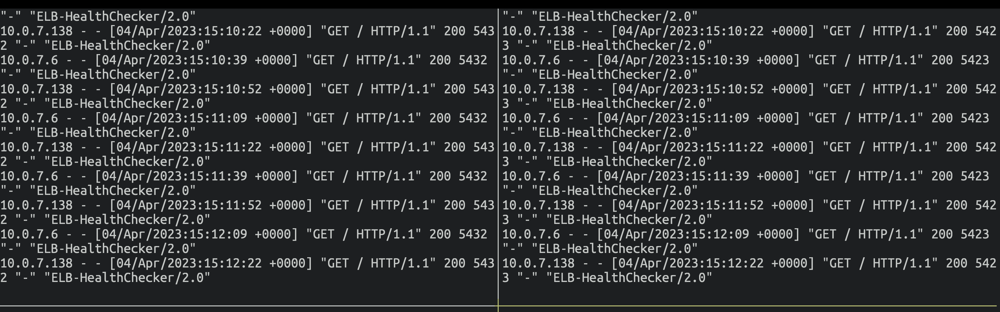
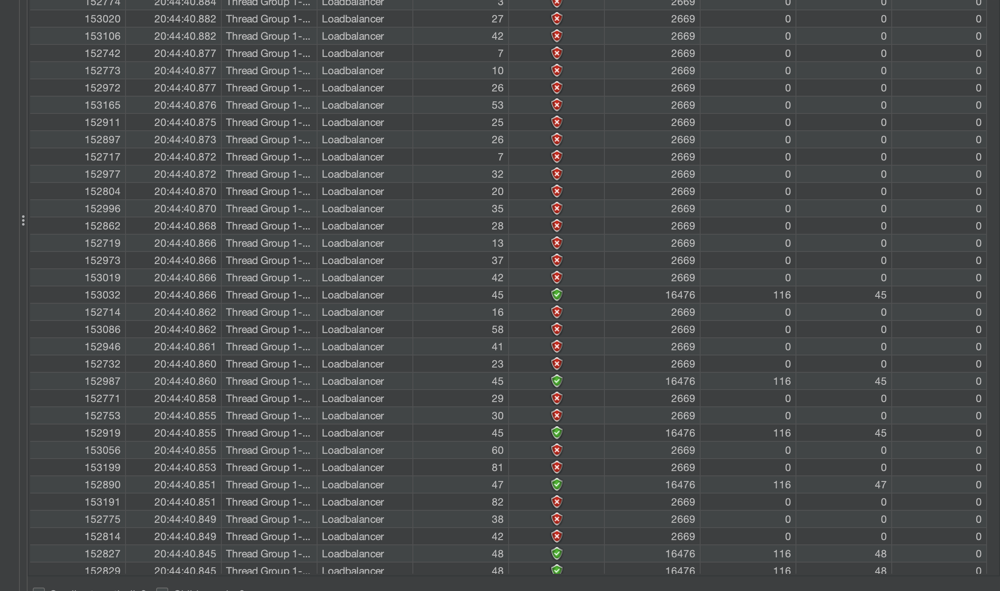
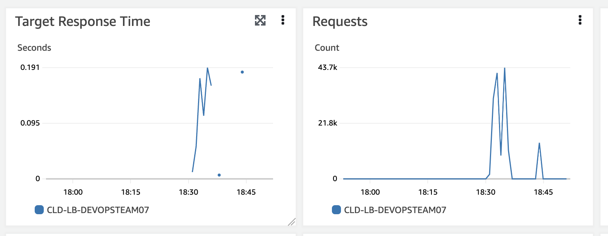
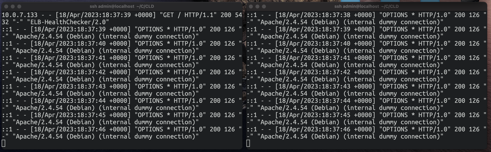
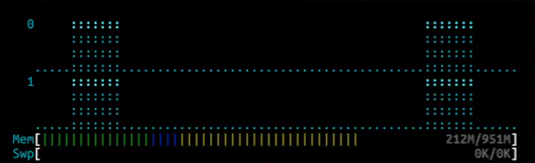
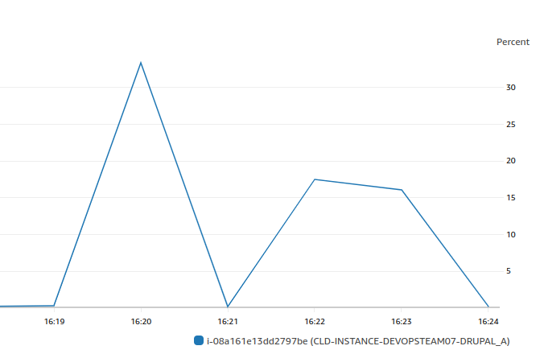

# L3 - Part I - Loading tools

### Step 0 - Testing policy

* [AWS Penetration Testing](https://aws.amazon.com/security/penetration-testing/)
* [AWS DDoS Testing Policy ](https://aws.amazon.com/security/ddos-simulation-testing/)

### Step 1 - JMeter

* [x] Download and install on your local machine the JMeter tool from [http://jmeter.apache.org/](http://jmeter.apache.org/).

```
shasum -a 512 apache-jmeter-5.5.zip
b24cdaa57234153df34a40bdc4501aa16f3286ca3e172eb889a5daa0ded86ab51388af1ea56e756df566a6f74f39f80eceb04e5d559668aeac9ec9759d6445ac  apache-jmeter-5.5.zip
```

 [ ] Open two terminal windows side-by-side and, using SSH, log into each instance. Bring up a continuous display of the Apache access log by running the command **sudo tail -f /var/log/apache2/access.log**. (path's log may differ depending on your apache config, e.g if you are using virtual host for you web app).



* [x] Observe the log. Are the source ip addresses those expected ?

Yes they are, they come from the ELB.

* [x] Through the AWS console, you can enable detailed (1-minute interval) monitoring of the two instances: Select an instance and click on the **Monitoring** tab. Click on the button **Manage detailed monitoring**.

```
//Observations
```

* [ ] Through the AWS console, you can enable detailed (1-minute interval) monitoring of the two instances: Select an instance and click on the **Monitoring** tab. Click on the button **Manage detailed monitoring**.

```
//TODO
https://awscli.amazonaws.com/v2/documentation/api/latest/reference/ec2/monitor-instances.html

[INPUT]
aws ec2 monitor-instances \
    --instance-ids i-08a161e13dd2797be i-040aa3a24bb078eeb

[OUTPUT]
InstanceMonitorings:
- InstanceId: i-08a161e13dd2797be
  Monitoring:
    State: pending
- InstanceId: i-040aa3a24bb078eeb
  Monitoring:
    State: pending
    
```

* [x] Consult the JMeter documentation [https://jmeter.apache.org/usermanual/build-web-test-plan.html](https://jmeter.apache.org/usermanual/build-web-test-plan.html) and create a simple test plan. Specify the load balancer as the target for the HTTP requests. Run a test load test based on http request listener.

```xml
<?xml version="1.0" encoding="UTF-8"?>
<jmeterTestPlan version="1.2" properties="5.0" jmeter="5.5">
  <hashTree>
    <TestPlan guiclass="TestPlanGui" testclass="TestPlan" testname="Test Plan" enabled="true">
      <stringProp name="TestPlan.comments"></stringProp>
      <boolProp name="TestPlan.functional_mode">false</boolProp>
      <boolProp name="TestPlan.tearDown_on_shutdown">true</boolProp>
      <boolProp name="TestPlan.serialize_threadgroups">false</boolProp>
      <elementProp name="TestPlan.user_defined_variables" elementType="Arguments" guiclass="ArgumentsPanel" testclass="Arguments" testname="User Defined Variables" enabled="true">
        <collectionProp name="Arguments.arguments"/>
      </elementProp>
      <stringProp name="TestPlan.user_define_classpath"></stringProp>
    </TestPlan>
    <hashTree>
      <ThreadGroup guiclass="ThreadGroupGui" testclass="ThreadGroup" testname="Thread Group" enabled="true">
        <stringProp name="ThreadGroup.on_sample_error">continue</stringProp>
        <elementProp name="ThreadGroup.main_controller" elementType="LoopController" guiclass="LoopControlPanel" testclass="LoopController" testname="Loop Controller" enabled="true">
          <boolProp name="LoopController.continue_forever">false</boolProp>
          <intProp name="LoopController.loops">-1</intProp>
        </elementProp>
        <stringProp name="ThreadGroup.num_threads">50</stringProp>
        <stringProp name="ThreadGroup.ramp_time">60</stringProp>
        <boolProp name="ThreadGroup.scheduler">false</boolProp>
        <stringProp name="ThreadGroup.duration"></stringProp>
        <stringProp name="ThreadGroup.delay"></stringProp>
        <boolProp name="ThreadGroup.same_user_on_next_iteration">true</boolProp>
      </ThreadGroup>
      <hashTree>
        <HTTPSamplerProxy guiclass="HttpTestSampleGui" testclass="HTTPSamplerProxy" testname="Loadbalancer" enabled="true">
          <elementProp name="HTTPsampler.Arguments" elementType="Arguments" guiclass="HTTPArgumentsPanel" testclass="Arguments" testname="User Defined Variables" enabled="true">
            <collectionProp name="Arguments.arguments"/>
          </elementProp>
          <stringProp name="HTTPSampler.domain">localhost</stringProp>
          <stringProp name="HTTPSampler.port">8080</stringProp>
          <stringProp name="HTTPSampler.protocol">http</stringProp>
          <stringProp name="HTTPSampler.contentEncoding"></stringProp>
          <stringProp name="HTTPSampler.path"></stringProp>
          <stringProp name="HTTPSampler.method">GET</stringProp>
          <boolProp name="HTTPSampler.follow_redirects">true</boolProp>
          <boolProp name="HTTPSampler.auto_redirects">false</boolProp>
          <boolProp name="HTTPSampler.use_keepalive">true</boolProp>
          <boolProp name="HTTPSampler.DO_MULTIPART_POST">false</boolProp>
          <stringProp name="HTTPSampler.embedded_url_re"></stringProp>
          <stringProp name="HTTPSampler.connect_timeout"></stringProp>
          <stringProp name="HTTPSampler.response_timeout"></stringProp>
        </HTTPSamplerProxy>
        <hashTree/>
        <ResultCollector guiclass="GraphVisualizer" testclass="ResultCollector" testname="results" enabled="true">
          <boolProp name="ResultCollector.error_logging">false</boolProp>
          <objProp>
            <name>saveConfig</name>
            <value class="SampleSaveConfiguration">
              <time>true</time>
              <latency>true</latency>
              <timestamp>true</timestamp>
              <success>true</success>
              <label>true</label>
              <code>true</code>
              <message>true</message>
              <threadName>true</threadName>
              <dataType>true</dataType>
              <encoding>false</encoding>
              <assertions>true</assertions>
              <subresults>true</subresults>
              <responseData>false</responseData>
              <samplerData>false</samplerData>
              <xml>false</xml>
              <fieldNames>true</fieldNames>
              <responseHeaders>false</responseHeaders>
              <requestHeaders>false</requestHeaders>
              <responseDataOnError>false</responseDataOnError>
              <saveAssertionResultsFailureMessage>true</saveAssertionResultsFailureMessage>
              <assertionsResultsToSave>0</assertionsResultsToSave>
              <bytes>true</bytes>
              <sentBytes>true</sentBytes>
              <url>true</url>
              <threadCounts>true</threadCounts>
              <idleTime>true</idleTime>
              <connectTime>true</connectTime>
            </value>
          </objProp>
          <stringProp name="filename"></stringProp>
        </ResultCollector>
        <hashTree/>
        <ResultCollector guiclass="TableVisualizer" testclass="ResultCollector" testname="View Results in Table" enabled="true">
          <boolProp name="ResultCollector.error_logging">false</boolProp>
          <objProp>
            <name>saveConfig</name>
            <value class="SampleSaveConfiguration">
              <time>true</time>
              <latency>true</latency>
              <timestamp>true</timestamp>
              <success>true</success>
              <label>true</label>
              <code>true</code>
              <message>true</message>
              <threadName>true</threadName>
              <dataType>true</dataType>
              <encoding>false</encoding>
              <assertions>true</assertions>
              <subresults>true</subresults>
              <responseData>false</responseData>
              <samplerData>false</samplerData>
              <xml>false</xml>
              <fieldNames>true</fieldNames>
              <responseHeaders>false</responseHeaders>
              <requestHeaders>false</requestHeaders>
              <responseDataOnError>false</responseDataOnError>
              <saveAssertionResultsFailureMessage>true</saveAssertionResultsFailureMessage>
              <assertionsResultsToSave>0</assertionsResultsToSave>
              <bytes>true</bytes>
              <sentBytes>true</sentBytes>
              <url>true</url>
              <threadCounts>true</threadCounts>
              <idleTime>true</idleTime>
              <connectTime>true</connectTime>
            </value>
          </objProp>
          <stringProp name="filename"></stringProp>
        </ResultCollector>
        <hashTree/>
        <ResponseAssertion guiclass="AssertionGui" testclass="ResponseAssertion" testname="Response Assertion" enabled="true">
          <collectionProp name="Asserion.test_strings">
            <stringProp name="49586">200</stringProp>
          </collectionProp>
          <stringProp name="Assertion.custom_message"></stringProp>
          <stringProp name="Assertion.test_field">Assertion.response_code</stringProp>
          <boolProp name="Assertion.assume_success">false</boolProp>
          <intProp name="Assertion.test_type">16</intProp>
        </ResponseAssertion>
        <hashTree/>
      </hashTree>
    </hashTree>
  </hashTree>
</jmeterTestPlan>
```

* [x] Observe which of the instances gets the load. Increase the load and re-run the test. Observe response times and time-outs. Repeat until you see unacceptable response times and/or time-outs.

Time-outs (red shields)



Loadbalancer monitoring



Logs



### Step 2 - Stress

* [x] Setup [htop](https://htop.dev/) and [stress](http://manpages.ubuntu.com/manpages/focal/man1/stress.1.html) on your drupal instance.
* [x] Stress your instance and observe it with htop.
* [x] Observe the monitoring view on the AWS Console.




### Step 3 - Analysis - <mark style="color:red;">JMeter testing approach only</mark>

* ~~<mark style="color:red;">Question regarding DNS Lookup removed</mark>~~
* Did this test really test the load-balancing mechanism?

```
Yes! We can clearly observe the round robin algorithm that balances the load between the instances. Both of them received approximately the same load during the stress test.
```

&#x20; What are the limitations of this simple test?&#x20;

```
- Artificial load generation: JMeter generates synthetic load that may not accurately represent the actual traffic patterns of users.

- Uniform load profile: The test may not take into account load variations over time or different types of requests, which may also not reflect real-world conditions.

- Feature testing: This test does not verify whether the application's features function correctly under load. It primarily focuses on performance and load-balancing.
```

What would be necessary to do realistic testing?

```
- Multiple JMeter clients: Use multiple instances of JMeter distributed across multiple machines to generate higher load and avoid bottlenecks related to the machine running JMeter.

- Realistic usage scenarios: Create test scenarios that realistically simulate end-user behavior, including load variations and different types of requests.
```

