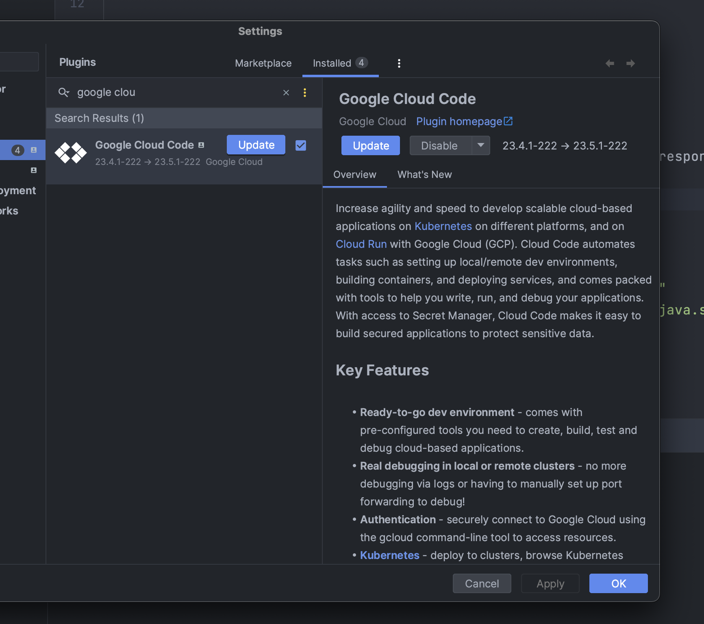

# L4 - Part 0 - Set up the development environment on your machine

* The version of your compiler (JDK)

For the following questions the versions may differ from what has been really done during the lab.

For this lab we used:

- jdk: amazon correto 11
- runtime version: 11.0.19

```
[INPUT]
java --version

[OUTPUT]
openjdk 19.0.1 2022-10-18
```

* The version of your run time environment (JRE)

```
[INPUT]
java --version

[OUTPUT]
OpenJDK Runtime Environment (build 19.0.1+10-21)
```

* The version of your Maven

```
[INPUT]
mvn -v
[OUTPUT]
Apache Maven 3.9.1 (2e178502fcdbffc201671fb2537d0cb4b4cc58f8)
```

* The version of your Gcloud (CLI)

```
[INPUT]
gcloud --version

[OUTPUT]
Google Cloud SDK 427.0.0
app-engine-java 2.0.13
app-engine-python 1.9.103
bq 2.0.91
cloud-datastore-emulator 2.3.0
core 2023.04.17
gcloud-crc32c 1.0.0
gsutil 5.23
```

* Screenshot of your IntelliJ Plug-in Google Cloud Code version


