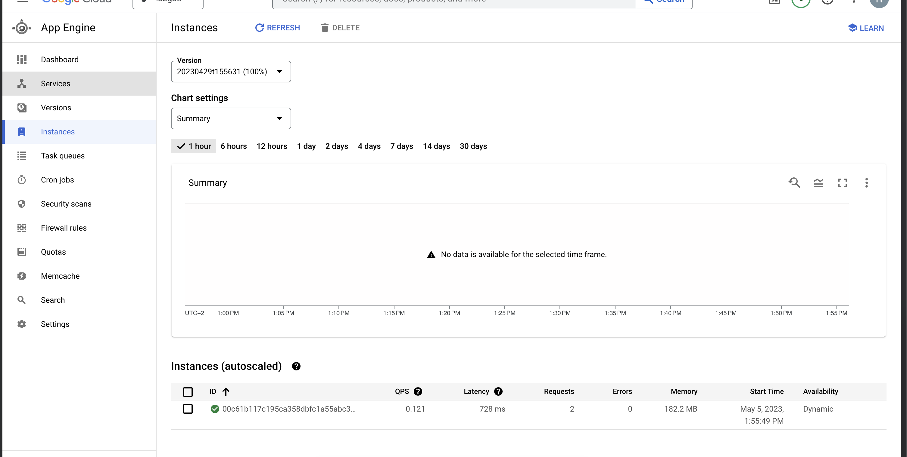
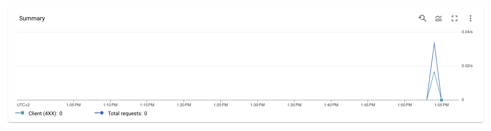

# L4 - Part I - Deployment of a simple web application

* Deliver the code to your repository

See the Task1 directory


Based on the result expected after the testing phase


* Screenshot showing your app running on App Engine

* Screenshot of the Google App Engine Dashboard showing your requests (traffic)

