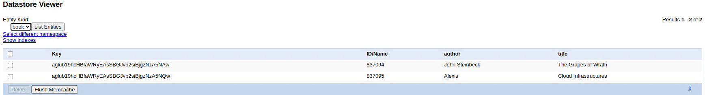
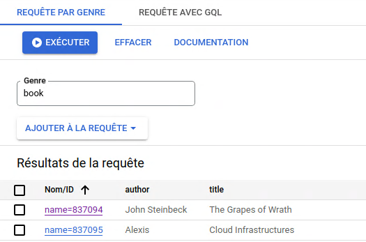

# L4 - Part II - Develop a Servlet that uses the datastore

* Deliver the code to your repository

See the Task2 directory

* Screenshot of the local and the App Engine console with the DataStore Viewer

* What does the sample code generated by the wizard do? Explain what you see in the **Java class files**, **web.xml**, **appengine-web.xml** and **index.jsp** files in a few sentences.

The wizard create a sample web application project in Java using JavaX Servlets. The default class `HelloAppEngine.java` contains the simple web server. 

The `webapp` directory contains a "jsp" file which is a file that'll be processed by the java template engine, it allows java code to be injected in HTML files.

In this same directory we find another directory `WEB-INF` wherein there is a file: `web.xml` it defines mappings between URL paths and the servlets that handle requests with those paths. The default files only defines which files to execute when we access the app without specifiying a file name in the url.

The `WEB-INF` contains also a file named `appengine-web.xml` that defines the runtime of the app and other miscellaneous properties.
