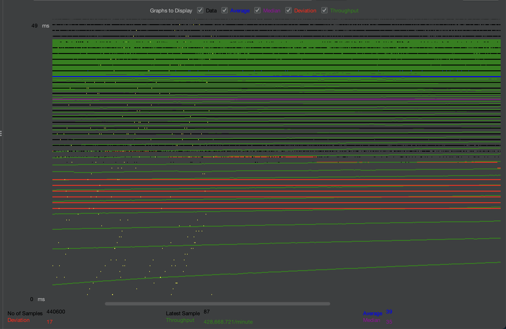
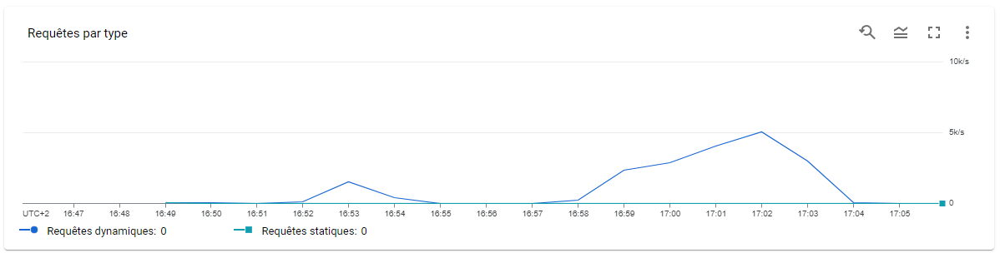
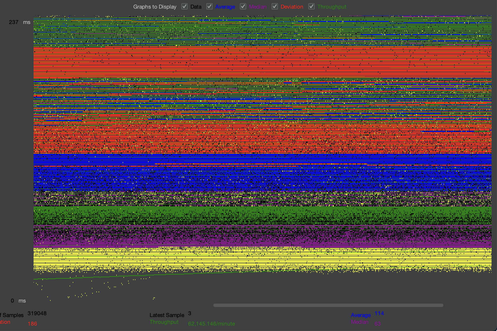
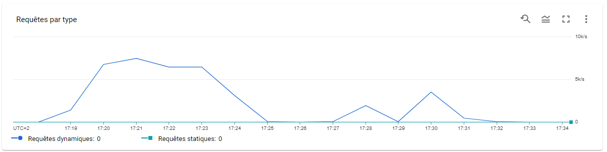
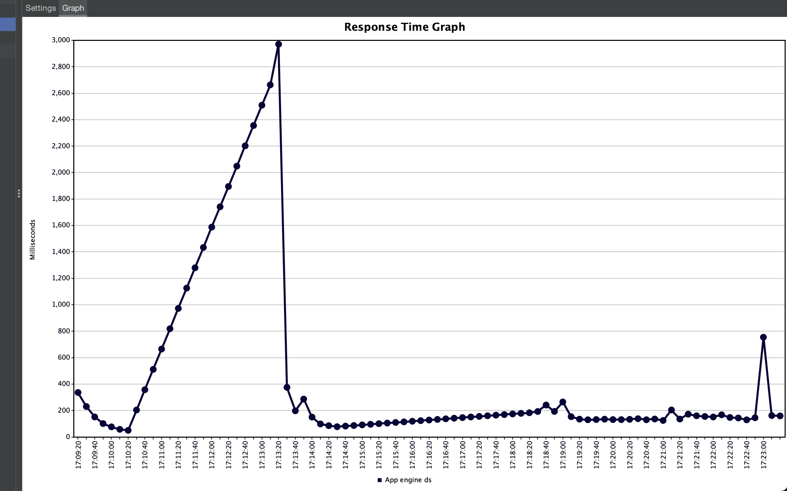
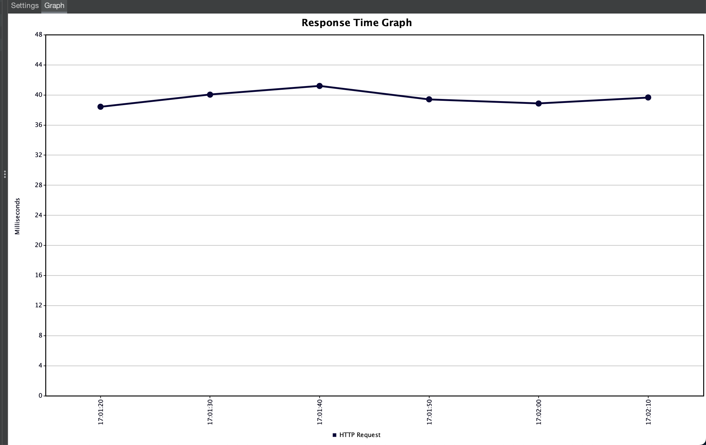
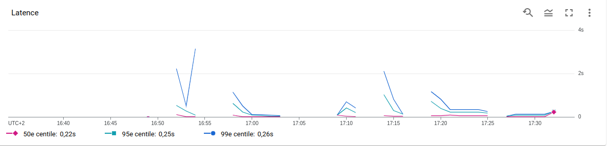
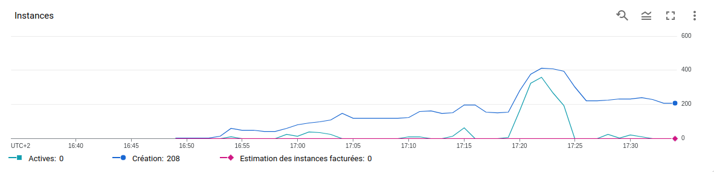
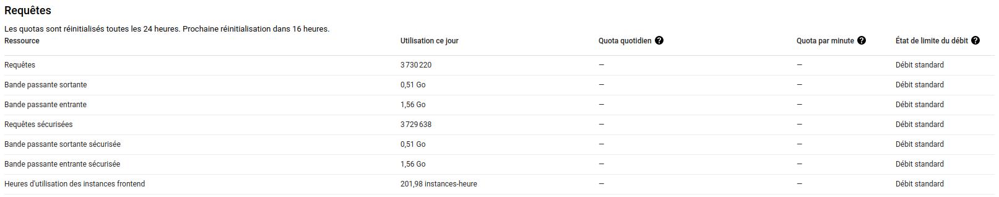
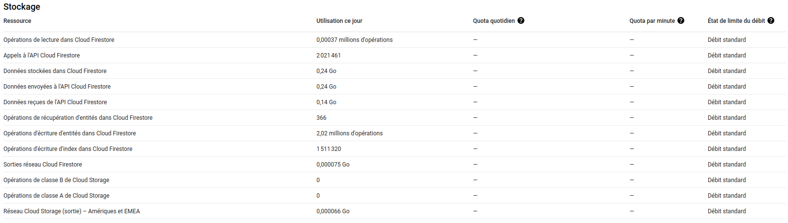

# L4 - Part III - Test the performance of datastore writes

* For each performance test copy a screenshot of the JMeter **Graph Results** listener and the App Engine **Dashboard** view into the report.

We used 1000 users to perform both stress tests.

Classic:

Datastore:

* What response times do you observe in the test tool for each Servlet?

Response time for the Datastore servlet:

Response time for the classic servlet:

The response time for the datastore servlet is naturally higher because writing operations are more expensive to compute. 

* Compare the response times shown by the test tool and the App Engine console. Explain the difference

Latency observed:

Scaling observed:

Initially we observe higher response time and latency in GAE and in jMeter. Once GAE started scaling out, the response time became low. 

The difference between GAE and jmeter is small. In the GAE console the latency is the duration that a request is waiting to be handled (transport latency) and the response time is the transport latency + the processing time. It explains why the latency is slightly lower than the response time.

* How many resources have you used to run these tests? From the **Quota Details** view of the console determine the non-zero resource quotas (**Daily quota** different from 0%). Explain each with a sentence. To get a sense of everything measured, click on **Show resources not in use**.

* Suppose you become suspicious that the algorithm for the automatic scaling of instances is not working correctly. Imagine a way in which the algorithm could be broken. Which measures shown in the console would you use to detect this failure?

We imagine the scaling doesn't work anymore e.g. it doesn't scale out on higher loads.

We can monitor the number of instances with the CPU utilizations and the response times, if it is significantly higher than expected and the instances count doesn't increase that would mean the scaling fails.