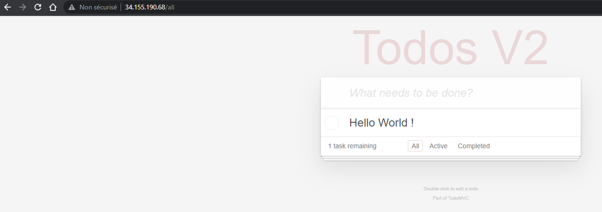

# L5 - Part II - Deploy the application in Kubernetes Engine

## Subtask 2.1 - Create a project

```
[INPUT]
gcloud projects create --name DEVOPSTEAM07-KUBERNETES
[OUTPUT]
No project id provided.

Use [devopsteam07-kubernetes-386914] as project id (Y/n)?  Y

Create in progress for [https://cloudresourcemanager.googleapis.com/v1/projects/devopsteam07-kubernetes-386914].
Waiting for [operations/cp.8268968581626404677] to finish...done.
Enabling service [cloudapis.googleapis.com] on project [devopsteam07-kubernetes-386914]...
Operation "operations/acat.p2-764694599012-f52e597b-e349-49fb-800b-fbd5d064df27" finished successfully.
```

## Subtask 2.2 - Create a cluster

```
[INPUT]
gcloud container clusters create gke-cluster-1 --region europe-west9-a --num-nodes 4

[OUTPUT]
kubeconfig entry generated for gke-cluster-1.
NAME           LOCATION        MASTER_VERSION   MASTER_IP      MACHINE_TYPE  NODE_VERSION     NUM_NODES  STATUS
gke-cluster-1  europe-west9-a  1.25.7-gke.1000  34.155.91.177  e2-medium     1.25.7-gke.1000  4          RUNNING
```

## Subtask 2.3 - Deploy the application on the cluster

* [x] Display available context

```
[INPUT]
kubectl config get-contexts

[OUTPUT]
CURRENT   NAME                                                              CLUSTER                                                           AUTHINFO                                                          NAMESPACE
*         gke_devopsteam07-kubernetes-386914_europe-west9-a_gke-cluster-1   gke_devopsteam07-kubernetes-386914_europe-west9-a_gke-cluster-1   gke_devopsteam07-kubernetes-386914_europe-west9-a_gke-cluster-1
          minikube                                                          minikube                                                          minikube                                                          default
```


Now, we will repeat the application deployment steps (Part 1.3 or this labo). The steps have been copied below.


* [x] Deploy the redis service and pod

```
[INPUT]
kubectl create -f redis-svc.yaml
kubectl create -f redis-pod.yaml

[OUTPUT]
service/redis-svc created
pod/redis created
```

* [x] Zoom in on a Kubernetes object and see much more detail

```
[INPUT]
kubectl describe pod/reds

[OUTPUT]
Name:             redis
Namespace:        default
Priority:         0
Service Account:  default
Node:             gke-gke-cluster-1-default-pool-84df5b48-x0v3/10.200.0.3
Start Time:       Tue, 16 May 2023 17:09:11 +0200
Labels:           app=todo
                  component=redis
Annotations:      <none>
Status:           Running
IP:               10.124.0.5
IPs:
  IP:  10.124.0.5
Containers:
  redis:
    Container ID:  containerd://62722cdbbcc0309734b92859dd72db757a2f49d3d4db5bfdc5e7a4586dd983ee
    Image:         redis
    Image ID:      docker.io/library/redis@sha256:ea30bef6a1424d032295b90db20a869fc8db76331091543b7a80175cede7d887
    Port:          6379/TCP
    Host Port:     0/TCP
    Args:
      redis-server
      --requirepass ccp2
      --appendonly yes
    State:          Running
      Started:      Tue, 16 May 2023 17:09:16 +0200
    Ready:          True
    Restart Count:  0
    Environment:    <none>
    Mounts:
      /var/run/secrets/kubernetes.io/serviceaccount from kube-api-access-6wls2 (ro)
Conditions:
  Type              Status
  Initialized       True
  Ready             True
  ContainersReady   True
  PodScheduled      True
Volumes:
  kube-api-access-6wls2:
    Type:                    Projected (a volume that contains injected data from multiple sources)
    TokenExpirationSeconds:  3607
    ConfigMapName:           kube-root-ca.crt
    ConfigMapOptional:       <nil>
    DownwardAPI:             true
QoS Class:                   BestEffort
Node-Selectors:              <none>
Tolerations:                 node.kubernetes.io/not-ready:NoExecute op=Exists for 300s
                             node.kubernetes.io/unreachable:NoExecute op=Exists for 300s
Events:
  Type    Reason     Age    From               Message
  ----    ------     ----   ----               -------
  Normal  Scheduled  8m47s  default-scheduler  Successfully assigned default/redis to gke-gke-cluster-1-default-pool-84df5b48-x0v3
  Normal  Pulling    8m46s  kubelet            Pulling image "redis"
  Normal  Pulled     8m42s  kubelet            Successfully pulled image "redis" in 3.984757182s (3.984771116s including waiting)
  Normal  Created    8m42s  kubelet            Created container redis
  Normal  Started    8m42s  kubelet            Started container redis
```

```
[INPUT]
kubectl describe service/redis-svc

[OUTPUT]
Name:              redis-svc
Namespace:         default
Labels:            component=redis
Annotations:       cloud.google.com/neg: {"ingress":true}
Selector:          app=todo,component=redis
Type:              ClusterIP
IP Family Policy:  SingleStack
IP Families:       IPv4
IP:                10.0.6.255
IPs:               10.0.6.255
Port:              redis  6379/TCP
TargetPort:        6379/TCP
Endpoints:         10.124.0.5:6379
Session Affinity:  None
Events:            <none>
```

* [x] Deploy the TODO-API Service and Pod

```
[INPUT]
kubectl create -f api-svc.yaml
kubectl create -f api-pod.yaml

[OUTPUT]
service/api-svc created
pod/api created
```

* [x] Verify that they are up and running on the correct ports

```
[INPUT]
kubectl get all

[OUTPUT]
NAME           READY   STATUS    RESTARTS   AGE
pod/api        1/1     Running   0          11m
pod/frontend   1/1     Running   0          10m
pod/redis      1/1     Running   0          13m

NAME                 TYPE        CLUSTER-IP   EXTERNAL-IP   PORT(S)    AGE
service/api-svc      ClusterIP   10.0.13.51   <none>        8081/TCP   11m
service/kubernetes   ClusterIP   10.0.0.1     <none>        443/TCP    25m
service/redis-svc    ClusterIP   10.0.6.255   <none>        6379/TCP   13m
```

## Subtask 2.4 - Deploy the frontend Service

```
[INPUT]
kubectl create -f frontend-svc.yaml

[OUTPUT]
service/frontend-svc created
```

* [x] Monitor the creation of the load balancer using :

```
[INPUT]
kubectl describe service/frontend-svc

[OUTPUT]
Name:                     frontend-svc
Namespace:                default
Labels:                   component=frontend
Annotations:              cloud.google.com/neg: {"ingress":true}
Selector:                 app=todo,component=frontend
Type:                     LoadBalancer
IP Family Policy:         SingleStack
IP Families:              IPv4
IP:                       10.0.3.77
IPs:                      10.0.3.77
LoadBalancer Ingress:     34.155.190.68
Port:                     http  80/TCP
TargetPort:               8080/TCP
NodePort:                 http  30976/TCP
Endpoints:                10.124.3.5:8080
Session Affinity:         None
External Traffic Policy:  Cluster
Events:
  Type    Reason                Age   From                Message
  ----    ------                ----  ----                -------
  Normal  EnsuringLoadBalancer  60s   service-controller  Ensuring load balancer
  Normal  EnsuredLoadBalancer   18s   service-controller  Ensured load balancer
```

Verify the TODO Application

* [x] Find out the public URL of the frontend load balancer

```
[INPUT]
kubectl describe service/frontend-svc

[OUTPUT]
LoadBalancer Ingress:     34.155.206.234
```

* [x] Access the public URL of the Service with a browser. You should be able to access the complete application and create a new Todo



